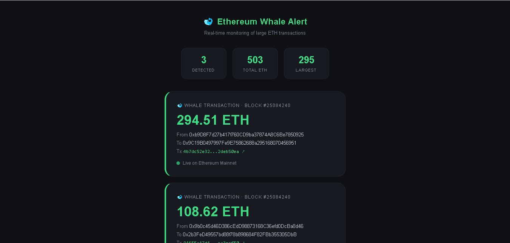

# Ethereum Whale Alert




Real-time Ethereum whale transaction monitor. Detects large ETH movements on-chain and displays them live with Telegram alert support.

## Demo

[](https://youtu.be/LF6v4rugDU0)

🔗 **Live Demo:** [https://ethereum-whale-alert.onrender.com](https://ethereum-whale-alert.onrender.com)
 
## Problem

Large ETH movements often signal market-moving events — exchange withdrawals, whale accumulation, or liquidations. There is no simple tool that monitors these in real time without requiring complex infrastructure.

## Features

- Real-time monitoring of ETH transactions above a configurable threshold
- Live dashboard showing whale movements, addresses, and block numbers
- Color-coded risk levels based on transaction size
- Direct links to Etherscan for each transaction
- Optional Telegram alerts for instant notifications
- Tracks total ETH moved and largest transaction detected

## Architecture

Ethereum Mainnet
↓
Infura RPC (web3.py)
↓
Block Monitor Thread → Filter by ETH threshold
↓
Flask API (/alerts endpoint)
↓
Frontend (polling every 15s) → Live Dashboard
↓
Telegram Bot (optional alerts)


## Stack

- **Python** — core monitoring logic
- **Flask** — web server and API
- **web3.py** — Ethereum node communication
- **HTML/CSS/JS** — real-time frontend
- **Telegram Bot API** — optional alerts

## Setup

### Requirements

- Python 3.10+
- Ethereum RPC URL (Infura or Alchemy)
- Telegram Bot Token (optional)

### Installation

```bash
git clone https://github.com/risks-analyst/ethereum-whale-alert
cd ethereum-whale-alert

python3 -m venv venv
source venv/bin/activate

pip install -r requirements.txt
```

### Configuration

Create a `.env` file:

RPC_URL=https://mainnet.infura.io/v3/YOUR_KEY
TELEGRAM_BOT_TOKEN=your_token_here
TELEGRAM_CHAT_ID=your_chat_id_here
MIN_ETH_THRESHOLD=100


### Run

```bash
python app.py
```

Open `http://localhost:5001`

## Risk Levels

| Color | Threshold | Meaning |
|-------|-----------|---------|
| 🟢 Green | 1–499 ETH | Standard large transfer |
| 🟡 Yellow | 500–999 ETH | Significant movement |
| 🔴 Red | 1000+ ETH | Major whale activity |

## Challenges & Learnings

 - Managing real-time block scanning in a background thread without blocking Flask
- Keeping the UI updated without WebSockets using efficient polling
- Filtering meaningful whale activity from high-frequency low-value transactions
- Handling RPC connection errors gracefully without crashing the monitor

## Roadmap

- [ ] WebSocket support for instant updates
- [ ] Token transfer whale detection (USDT, USDC, WETH)
- [ ] Historical whale activity chart
- [ ] Multi-chain support (Arbitrum, Base, Polygon)
- [ ] Wallet tagging (known exchanges, protocols)

## License

MIT License


